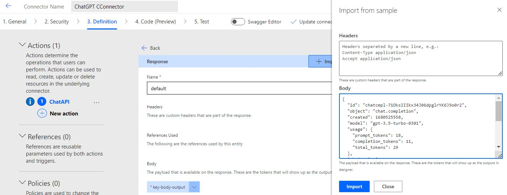

# Lab 1: Integrating ChatGPT API with Power Apps

---

> In this exercise, you will learn how to use the **ChatGPT API** in Power Apps, here we will learn the basics in order to gain the fundamental knowledge and become capable of using it in more advanced projects.

### Prerequisites

- Knowledge of Power Platform
- Knowledge of Power App

---

## Creating a Custom Connector

1. Navigate to the Power Apps home page.
2. On the left pane, click on `Discover
   
   
3. On the right, under `Data`, click on `Custom connectors`
   
   
4. On the top right, click on `New custom connector` and choose `Create from blank` from the dropdown
   
   
5. In the pop-up, name your custom connector "`ChatGPTCConnector`" and click `Continue`

---

## Configuring our Custom Connector

In the Connector page, configure the custom connector in the following tabs:

### In the `General` tab

- Find the `Host` text box and enter `api.openai.com`
- We can also upload an icon for our new connector


### In the `Security` tab

1. In the Authentication type section, choose `API Key` from the dropdown
2. For the **'Parameter label'** text box, enter **'API Key'**
3. For the **'Parameter name'** text box, enter **'Authorization'**
   
 

### In the `Definition` tab

1. On the left, under Actions, click on **'New action'**
2. In the `General` section on the right
   1. In the **'Summary'** text box, enter **'ChatGPT API'**
   2. In the **'Operation ID'** text box, enter **'ChatAPI'**
   
 

1. Under the 'General' section, in the Request section, click on **'Import from sample'**, and in the pop-up on the right, enter the following:
   1. For the **'Verb'** choose `POST`
   2. For the **'URL'** enter 'https://api.openai.com/v1/chat/completions'
   3. For the **'Headers'**, enter:
      ```
      Content-Type application/json
      ```
   4. For the **'Body'**, enter:
      ```
      {
        "model": "gpt-3.5-turbo",
        "messages": [{"role": "", "content":""}]
      }
      ```
   5. Click `Import`
   
 

1. Back in the `Request` section, scroll down to the `Headers` dropdown **'Content-Type'**, click on it > Edit

 

2. Now in the `Parameter` section
   1. For **'Default value'**: enter **'application/json'**
   2. For the **'Is it required?'** checkboxes, choose `Yes`
   3. For the **'Visibility'** checkboxes, choose `internal`

 

   4. At the top of the section, click **'Back'**
3. Back in the `Request` section, scroll down to the `Body` dropdown **'body'**, click on it > Edit
   1. For the **'Is it required?'** checkboxes, choose `Yes`
   2. For the **'Visibility'** checkboxes, choose `important`
   3. At the bottom of the section, we have 3 properties: 'content', role' and 'model',

 

   we will do the same for the 3, for each property click on it > Edit:
      1. For the **'Is it required?'** checkboxes, choose `Yes`
      2. For the **'Visibility'** checkboxes, choose `important`
      3. Click 'Back'
   4. At the top of the section, click **'Back'**

> Before testing, we have to create the connector; on the top right click `Create connector`.

 

> After creation, we need an API key in order to call the API

Each user will get an API key to use when making a request to OpenAI, this key is confidential and shouldn't be shared, in case the key was compromised you should regenerate a new key, in our case we can get our API key from the OpenAI website

1. Go to [the OpenAI Platform](https://platform.openai.com/) (https://platform.openai.com/)
2. On the top right, click on the circle
3. From the dropdown, choose 'View API keys'

 

4. Here you can see your created api keys, delete them, or create a new api key
5. Click on 'Create new secret key'
6. Your new api key should now be displayed, copy and paste it somewhere safe, because you will not be able to display it again

   

### In the `Test` tab

In the `Connections` section, click on **'New connection'**, a pop-up will appear to store our API key. Enter your API key in this form:

```
Bearer <YOUR_API_KEY_HERE>
```

Enter your API secret key in here and remove the `<>`, this is an example:

```
Bearer sk-123Abc456xY123456abc123456
```

After entering your API key, click on **'Create'** in the pop-up window

 

### Testing the API

1. On the left pane, click on `Custom connectors` (or access it from the Discover tab)
2. Here we can see a list of our custom connectors, on the right of our new connector, click **'Edit'**
   
    

3. Now go to the `Test` tab again
4. In the `Operations` section, we can fill the parameters to send with our API call to test it
   1. For **'model'**: enter **'gpt-3.5-turbo'**
   2. For **'role'**: enter **'user'**
   3. For **'content'**: ask a question to the API (for example: who is the first president of the United States?)
      
       

   4. Then click on `Test operation`
5. After testing the operation, we should receive a response including a 'Status', 'Headers' and 'Body', copy the response Body content
6. Go back to the `Definition` tab, scroll down to the `Response` section and click **'default'**
7. Click on `Import from sample`, this will open a pop-up window on the right
8. Paste the **'response body'** inside the **'Body'** text area, and click `Import`
   
    

9. On the top right, click `Update connector`

---

## Creating a Canvas App

After successfully creating our Custom connector, we can go ahead and add it to a Canvas app and make it more useful. Go back to the `Power Apps` home page

1. In the left pane, click on 'Home' and then click on `Blank app`, and from the pop-up window choose the **'Blank canvas app'** option
2. Give your app a name and choose **'Phone'** for the **Format**, then click **'Create'**
3. In the 'Canvas app' page, in the left pane, click on `Data` then `Add data`, and choose your custom connector from the dropdown, as well as the **'connection'** right after in the same dropdown
   
    

4. In the left pane, go to the `Insert` tab
5. Insert a **'Text Input'** control by dragging it to the app screen
6. We can remove the default placeholder for the text box by changing the "Text input" text in the middle top of the screen
7. Then insert a **'Send'** button by dragging it to the screen
   
8. While the 'send' button is selected, we should see **'OnSelect'** in the top left of our screen, now we can specify what will happen when a user clicks on the 'Send' button.
   - For this click on `Data` in the left pane and choose your custom connector
9. Now in the top middle of the screen we can specify what action to call from our custom connector as well as send parameters with it when the 'Send' button is pressed

- Enter the name of your connector then the name of your action as well as the parameters in this format

```
ChatGPTCConnector.ChatAPI("gpt-3.5-turbo",Collect(colChat,{role:"user",content:TextInput1.Text}))
```

- Store the response in a variable "`varResponse`" so the new formula will look like:
```
Set(varResponse,ChatGPTCConnector.ChatAPI("gpt-3.5-turbo",Collect(colChat,{role:"user",content:TextInput1.Text})));
```

- Now, once we get the response, we want to ensure that we store that response as well on this collection:
- So, add this line of code at the end of the above formula where `choices` is an array that will return a list of information from the API, we just need the first value which is the response from the API

```
Collect(colChat, First(varResponse.choices).message);
```

- At the end of this, make sure we reset the text input control by adding this formula into the same formula bar
```
Reset(TextInput1)
```

- The formula at the end will look like this:
```
Set(varResponse,ChatGPTCConnector.ChatAPI("gpt-3.5-turbo",Collect(colChat,{role:"user",content:TextInput1.Text})));
Collect(colChat, First(varResponse.choices).message);
Reset(TextInput1)
```

### Displaying the Bot message

In the `Insert` tab of our canvas app, add a `Flexible height gallery` to append the conversation messages to

1. When adding the 'Flexible height gallery', in the right pane, set the Layout to **'Blank'**
2. Set the **'Data source'** to be **'colChat'** (or the name you chose for the collection)
   
    

3. In the app screen, click on **'Edit'** and insert a **'Text Label'** to display the role of the message (if it was said by the user of the bot)
   - to do that, in the formula bar, type: **'ThisItem.role'**
4. Add another **'Text Label'** to the right of the role text label
   1. Set the new text label's auto height to 'On'
   2. in the formula bar type: **'ThisItem.content'**

 

---
## Beautify the application:

#### Some ideas you could do:
1. add a header to your app, click on Insert Shape and select the rectangle, then place it at the top of the application
2. Insert Label Text and type in a title for your application.
3. add a "Reset" icon with the following PowerFX Formula to reset the converstation in the gallery
```
Clear(colChat);
```
4. Adjust the borders of the user input box
5. Switch the "user" and "assistant" text lable to images and make them dynamic to show ChatGPT icon or the User's profile pic using the `User().Image` PoweFX and set a variable with condition assiciated to the hidden labels on the `Visibility` property of each image.
6. Add a loader GIF Image and set it's `visibility` to a variable that changes from `false` to `true` when the "Send" button is clicked before the API is Called.

   > Feel free to edit and change in the application as much as you woud like as this canvas app is fully editable.

 

## Summary

Congrats, you can now integrate the ChatGPT API in Power Apps Canvas App, build on that knowledge with the next lab where we will ...
